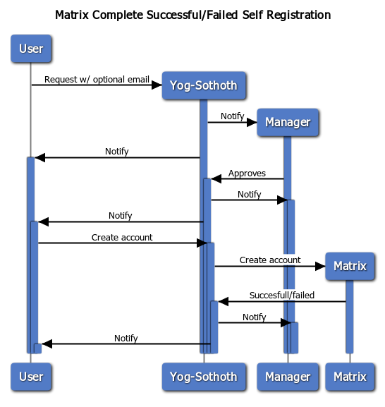
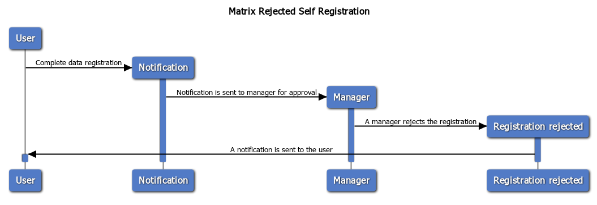
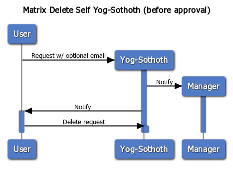
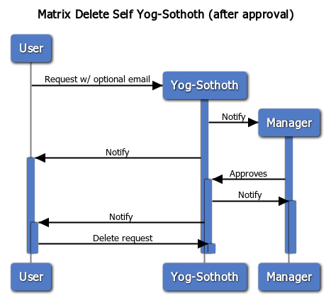

# Yog-Sothoth: Matrix Self Register App

A small [FastAPI](https://fastapi.tiangolo.com/) backend and [svelte](https://svelte.dev/) frontend app that allows anyone to register to a Matrix home server with admin approval.

> Yog-Sothoth knows the gate. Yog-Sothoth is the gate. Yog-Sothoth is the key and guardian of the gate.

## Basic Flow and Idea

A user creates a new registration, optionally sending an email to receive notifications. It receives a registration unique identifier (*rid*) and a *token* to access its data. If the user doesn't input an email, it will have to manually check the registration request status using its token. This registration request can be deleted at any time by its owner (anyway, it will be automatically deleted after a certain amount of time, 48hs by default).

When a registration request is received, an email is sent to the managers containing the *manager token* and the registration unique identifier (*rid*). Then, any manager can approve or reject the registration request using this token.

Currently, registration requests status can only be changed once: they're either approved or rejected and that's it.

Once the registration is approved, the user is required to send its username and optionally an email (again, to receive notifications). A password is sent back as response and an account is created in the Matrix home server with the given username (note: it could fail and must be retried from the beginning). 

You can read more about the API in the back-end subdirectory [readme](backend/README.md).

### Security Characteristics

The user and manager tokens are stored as an Argon2id hash.  The username and password is never stored, only the user email if any (but can not be seen by any manager, no matter what).
When a manager requests user's data, it will only receive information about the status and timestamps, but won't be able to see any other information.
Both the user and managers share information using the *rid*. This permits for a user's data to remain unknown for the managers but enables potential human interaction with each other, i.e.: asking in a group if someone sent a registration request.

Note: the user email is stored in plaintext. This means that a system administrator could access the database and see this value (only a user with root access to the Operating System, not a *manager*).

### Diagrams

# Deployment

We have built a Docker image for the API back-end (the front-end uses solely Nginx), get it from [the repo](https://git.rlab.be/sysadmins/yog_sothoth/container_registry). Note that the back-end image uses Gunicorn as server and it is prepared to be used with Nginx as a proxy. DO NOT use it directly without an Nginx proxy.  
Additionally, sample compose and Nginx config files are found in the [deploy](deploy) subdirectory. Simply copy them to your server and run them.

## License

**Yog-Sothoth** is made by [Erus](https://erudin.github.io/), [Fedr](https://fedr.cc/) and [HacKan](https://hackan.net) under GNU GPL v3.0+. You are free to use, share, modify and share modifications under the terms of that [license](LICENSE).

    Copyright (C) 2019
     Erus (https://erudin.github.io/)
     Fedr (https://fedr.cc/)
     HacKan (https://hackan.net)

    This program is free software: you can redistribute it and/or modify
    it under the terms of the GNU General Public License as published by
    the Free Software Foundation, either version 3 of the License, or
    (at your option) any later version.

    This program is distributed in the hope that it will be useful,
    but WITHOUT ANY WARRANTY; without even the implied warranty of
    MERCHANTABILITY or FITNESS FOR A PARTICULAR PURPOSE.  See the
    GNU General Public License for more details.

    You should have received a copy of the GNU General Public License
    along with this program.  If not, see <http://www.gnu.org/licenses/>.
