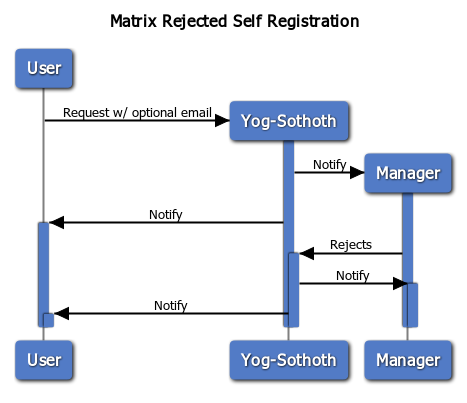

# Yog-Sothoth: Matrix Self Register App

A small [FastAPI](https://fastapi.tiangolo.com/) based app that allows anyone to register to a Matrix homeserver with admin approval.

> Yog-Sothoth knows the gate. Yog-Sothoth is the gate. Yog-Sothoth is the key and guardian of the gate.

## Basic flow and idea

A user creates a new registration sending its username and optionally an email. It receives a unique identifier and a token to access its data.  
Then a manager can approve or reject the registration. If the user gave an email address it will receive an email with the information. Otherwise, it will be able to find that information on the app using its token.

### Diagrams

## API Endpoints

* `/registrations/`: User registrations
  * **POST**: New user registration.
    * Request: `{"username": "<username>", "email": "[<email>]"}`
    * Response: *201* `{"username": "<username>", "email": "<email>", "password": null, "rid": "<registration identifier>", "token": "<token>", "created": "<created datetime>", "modified": "<modified datetime>", "status": "pending", "registration_status": "pending"}`, *422*
* `/registrations/:rid/`: Manage a user registration
  * **GET**: Show user information according to access token: minimal or full.
    * Request: `null` `Authorization: <manager_token>`
    * Response: *200* `{"username": null, "email": null, "password": null, "rid": "<registration identifier>", "created": "<created datetime>", "modified": "<modified datetime>", "status": "<pending/approved/rejected>", "registration_status": "<pending/success/failed>"}`, *401* `null`, *403* `null`, *404* `null`
    * Request: `null` `Authorization: <user_token>`
    * Response: *200* `{"username": "<username>", "email": "<email>", "password": "<password>", "rid": "<registration identifier>", "created": "<created datetime>", "modified": "<modified datetime>", "status": "<pending/approved/rejected>", "registration_status": "<pending/success/failed>"}`, *401* `null`, *403* `null`, *404* `null`
  * **PUT**: Change registration status
    * Request: `{"status": "approved"}` `Authorization: <manager_token>`
    * Response: *200* `{"username": null, "email": null, "password": null, "rid": "<registration identifier>", "created": "<created datetime>", "modified": "<modified datetime>", "status": "approved", "registration_status": "pending"}`, *401* `null`, *403* `null`, *404* `null`, *422*
    * Request: `{"status": "rejected"}` `Authorization: <manager_token>`
    * Response: *200* `{"username": null, "email": null, "password": null, "rid": "<registration identifier>", "created": "<created datetime>", "modified": "<modified datetime>", "status": "rejected", "registration_status": "pending"}`, *401* `null`, *403* `null`, *404* `null`, *422*
  * **DELETE**: Remove registration.
    * Request: `null` `Authorization: <manager_token>`
    * Response: *204* `{"username": null, "email": null, "password": null, "rid": "<registration identifier>", "created": "<created datetime>", "modified": "<modified datetime>", "status": "<pending/approved/rejected>", "registration_status": "<pending/success/failed>"}`, *401* `null`, *403* `null`, *404* `null`
    * Request: `null` `Authorization: <user_token>`
    * Response: *204* `{"username": "<username>", "email": "<email>", "password": "<password>", "rid": "<registration identifier>", "created": "<created datetime>", "modified": "<modified datetime>", "status": "<pending/approved/rejected>", "registration_status": "<pending/success/failed>"}`, *401* `null`, *403* `null`, *404* `null`

## License

**Yog-Sothoth** is made by [Erus](https://erudin.github.io/) and [HacKan](https://hackan.net) under GNU GPL v3.0+. You are free to use, share, modify and share modifications under the terms of that [license](LICENSE).

    Copyright (C) 2019
     Erus (https://erudin.github.io/)
     HacKan (https://hackan.net)

    This program is free software: you can redistribute it and/or modify
    it under the terms of the GNU General Public License as published by
    the Free Software Foundation, either version 3 of the License, or
    (at your option) any later version.

    This program is distributed in the hope that it will be useful,
    but WITHOUT ANY WARRANTY; without even the implied warranty of
    MERCHANTABILITY or FITNESS FOR A PARTICULAR PURPOSE.  See the
    GNU General Public License for more details.

    You should have received a copy of the GNU General Public License
    along with this program.  If not, see <http://www.gnu.org/licenses/>.
